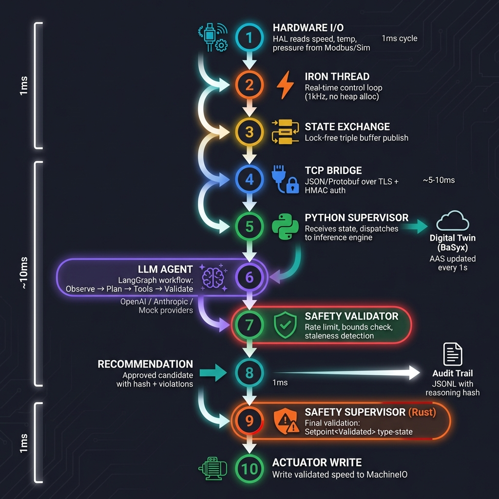

<p align="center">
  
  
  
  
</p>

<h1 align="center">⚡ NeuroPLC</h1>

<p align="center">
  <strong>Safety-First Agentic Industrial Controller</strong><br>
  <em>Where AI meets hard real-time control — and the machine always wins.</em>
</p>

<p align="center">
  <a href="#-quick-start">Quick Start</a> •
  <a href="#-architecture">Architecture</a> •
  <a href="#-features">Features</a> •
  <a href="#-deployment">Deployment</a> •
  <a href="docs/safety/safety-case.md">Safety Case</a>
</p>

---

## 🎯 What is NeuroPLC?

NeuroPLC is a **hybrid industrial controller** that combines the flexibility of AI-based decision making with the reliability of deterministic real-time control. It's designed for scenarios where:

- 🤖 **AI can suggest** — but unsafe commands must be rejected
- ⏱️ **1ms cycle times** are non-negotiable
- 📊 **Every decision is auditable** with cryptographic hashes
- 🏭 **Industrial protocols** (OPC UA, Modbus, AAS) are required

<p align="center">
  
</p>

---

## 🚀 Quick Start

### Prerequisites

- **Rust** 1.75+ (`rustup update`)
- **Python** 3.11+ with venv

### Run in 30 seconds

```bash
# Terminal 1: Start the Rust spine
cargo run --release

# Terminal 2: Start the Python cortex
cd python-cortex && python3 -m venv .venv && source .venv/bin/activate
pip install -e .
python run_supervisor.py
```

### Test the Safety Firewall

```bash
# Try to break it (you can't)
python run_supervisor.py --attack-mode
```

The cortex will periodically request **5000 RPM** (above the 3000 RPM limit). Watch the spine reject every unsafe command.

---

## 🏗️ Architecture

<p align="center">
  
</p>

### Crate Structure

| Crate | Purpose | Key Types |
|-------|---------|-----------|
| **`core-spine`** | Real-time control loop, safety logic, HAL | `IronThread`, `Setpoint<Validated>`, `SafetyLimits` |
| **`neuro-io`** | Bridge I/O, protocols, auth, metrics | `BridgeConfig`, `ModbusMotor`, `TlsConfig` |
| **`neuro-plc`** | Runtime orchestration, integrations | `RuntimeConfig`, OPC UA, Rerun |

### Python Cortex

| Module | Purpose |
|--------|---------|
| `agent/supervisor.py` | ML-based recommendations + TCP client |
| `agent/ml_inference.py` | ONNX Runtime wrapper with safety bounds |
| `digital_twin/basyx_adapter.py` | AAS creation & live updates |

---

## ✨ Features

### 🛡️ Safety-First Design

```rust
// Type-state pattern: Only validated setpoints reach the actuator
let raw = Setpoint::<Unvalidated>::new(target_speed);
let safe = raw.validate(&limits, current_speed, temp)?;  // Returns Setpoint<Validated>
io.write_speed(safe.value());  // ✓ Compile-time safety guarantee
```

**Safety checks enforced:**
- ❌ NaN/Infinity rejection
- ❌ Overspeed protection (max 3000 RPM)
- ❌ Rate-of-change limiting (50 RPM/cycle)
- ❌ Temperature interlock (80°C threshold)

### 🔐 Enterprise Security

| Feature | Implementation |
|---------|----------------|
| **TLS 1.3** | rustls with certificate-based auth |
| **HMAC Tokens** | SHA-256 signed, time-bounded |
| **OPC UA Security** | Basic256Sha256 + SignAndEncrypt |
| **Audit Trail** | JSONL with SHA-256 reasoning hashes |

### 📊 Observability

```bash
# Enable Prometheus metrics
cargo run --release -- --metrics-addr 0.0.0.0:9090

# View metrics
curl http://localhost:9090/metrics
```

**Exposed metrics:**
- `neuroplc_cycles_executed_total` — Control loop iterations
- `neuroplc_safety_rejections_total` — Rejected unsafe commands
- `neuroplc_cycle_jitter_microseconds` — Timing precision histogram

### 🏭 Industrial Protocols

| Protocol | Status | Usage |
|----------|--------|-------|
| **OPC UA** | ✅ | `--features opcua --opcua` |
| **Modbus TCP** | ✅ | `--modbus 192.168.1.10:502` |
| **AAS/BaSyx** | ✅ | Python cortex auto-creates submodels |
| **AASX Export** | ✅ | `python scripts/export_aasx.py` |

### 🧠 AI/ML Integration

```bash
# Train your own model
cd python-cortex
python -m agent.train_model

# Run with ML inference
python run_supervisor.py --model models/neuro_v1.onnx
```

**ML Pipeline:**
- RandomForest → ONNX export
- Safety-bounded recommender wrapper
- Full audit trail with model hash

### 🤖 Agentic LLM Supervisor (Advisory)

Enable the LLM inference engine in the Python cortex (advisory only; the Rust spine
still performs deterministic validation).

#### Inference Engines

| Engine | Description | Use Case |
|--------|-------------|----------|
| `baseline` | Rule-based recommendations | Default, no API needed |
| `llm` | Simple LLM completion | Basic text-based reasoning |
| `llm-agent` | Tool-calling agent | OpenAI with function calling |
| `llm-provider` | Provider-agnostic agent | Supports OpenAI + Anthropic |
| `langgraph` | Full workflow graph | Multi-step with critic validation |

#### OpenAI Provider

```bash
export NEUROPLC_INFERENCE_ENGINE=llm-agent
export NEUROPLC_LLM_PROVIDER=openai
export OPENAI_API_KEY=your_key
python run_supervisor.py
```

#### Anthropic Claude Provider

```bash
export NEUROPLC_INFERENCE_ENGINE=llm-provider
export NEUROPLC_LLM_PROVIDER=anthropic
export ANTHROPIC_API_KEY=your_key
python run_supervisor.py
```

#### LangGraph Workflow Engine

Multi-step workflow with tool execution and critic validation:

```bash
export NEUROPLC_INFERENCE_ENGINE=langgraph
export NEUROPLC_LLM_PROVIDER=openai  # or anthropic
export OPENAI_API_KEY=your_key
python run_supervisor.py
```

Workflow: **Observe → Plan → Execute Tools → Validate → Critic → Finalize**

### 💾 Caching

#### LLM Semantic Cache

Reduce redundant LLM calls with similarity-based caching:

```bash
export NEUROPLC_LLM_CACHE_ENABLED=1
export NEUROPLC_LLM_CACHE_THRESHOLD=0.95  # Similarity threshold
export NEUROPLC_LLM_CACHE_TTL_S=60
```

#### BaSyx Property Cache

Cache digital twin property reads with TTL per submodel type:

```bash
export BASYX_CACHE_ENABLED=1
export BASYX_CACHE_TTL_SAFETY_S=300      # Safety parameters
export BASYX_CACHE_TTL_NAMEPLATE_S=3600  # Static equipment info
```

---

## 📋 Environment Variables

### Core Settings

| Variable | Default | Description |
|----------|---------|-------------|
| `NEUROPLC_MIN_SPEED_RPM` | `0` | Minimum allowed speed |
| `NEUROPLC_MAX_SPEED_RPM` | `3000` | Maximum allowed speed |
| `NEUROPLC_MAX_RATE_RPM` | `50` | Max rate of change per cycle |
| `NEUROPLC_MAX_TEMP_C` | `80` | Temperature interlock threshold |
| `NEUROPLC_WARMUP_CYCLES` | `5` | Initial hold cycles |
| `NEUROPLC_STATE_STALE_US` | `500000` | Staleness timeout (microseconds) |
| `NEUROPLC_DISABLE_RATE_LIMIT` | `0` | Disable rate limiting (testing only) |

### LLM Configuration

| Variable | Default | Description |
|----------|---------|-------------|
| `NEUROPLC_INFERENCE_ENGINE` | `baseline` | Engine: `baseline`, `llm`, `llm-agent`, `llm-provider`, `langgraph` |
| `NEUROPLC_LLM_PROVIDER` | `openai` | Provider: `openai`, `anthropic`, `mock` |
| `NEUROPLC_LLM_MODEL` | `gpt-4o-mini` | Model identifier |
| `NEUROPLC_LLM_TIMEOUT_MS` | `800` | Request timeout |
| `NEUROPLC_LLM_DECISION_PERIOD_MS` | `500` | Min interval between LLM calls |
| `NEUROPLC_LLM_MAX_STEPS` | `4` | Max tool-calling iterations |
| `NEUROPLC_LLM_FAILURE_THRESHOLD` | `5` | Failures before circuit breaker |
| `NEUROPLC_LLM_COOLDOWN_S` | `30` | Circuit breaker cooldown |
| `NEUROPLC_LLM_ENABLE_CRITIC` | `0` | Enable LLM critic pass |
| `NEUROPLC_CORTEX_AUDIT_PATH` | — | JSONL audit log path |
| `OPENAI_API_KEY` | — | OpenAI API key |
| `ANTHROPIC_API_KEY` | — | Anthropic API key |

### LLM Caching

| Variable | Default | Description |
|----------|---------|-------------|
| `NEUROPLC_LLM_CACHE_ENABLED` | `0` | Enable semantic caching |
| `NEUROPLC_LLM_CACHE_THRESHOLD` | `0.95` | Similarity threshold |
| `NEUROPLC_LLM_CACHE_TTL_S` | `60` | Cache TTL (seconds) |

### BaSyx / Digital Twin

| Variable | Default | Description |
|----------|---------|-------------|
| `BASYX_URL` | `http://localhost:8081` | BaSyx API endpoint |
| `BASYX_AAS_ID` | `urn:neuroplc:aas:motor:001` | AAS identifier |
| `BASYX_ASSET_ID` | `urn:neuroplc:asset:motor:001` | Asset identifier |
| `BASYX_UPDATE_INTERVAL` | `1.0` | Update frequency (seconds) |
| `BASYX_CACHE_ENABLED` | `1` | Enable property caching |
| `BASYX_CACHE_TTL_SAFETY_S` | `300` | Safety property TTL |
| `BASYX_CACHE_TTL_NAMEPLATE_S` | `3600` | Nameplate property TTL |

### Authentication

| Variable | Default | Description |
|----------|---------|-------------|
| `NEUROPLC_SEND_HELLO` | `0` | Enable protocol handshake |
| `NEUROPLC_AUTH_SECRET` | — | HMAC signing secret |
| `NEUROPLC_AUTH_ISSUER` | `neuroplc` | Token issuer |
| `NEUROPLC_AUTH_AUDIENCE` | `neuroplc-spine` | Token audience |
| `NEUROPLC_AUTH_SCOPE` | `cortex:recommend` | Token scope |
| `NEUROPLC_AUTH_MAX_AGE` | `300` | Token validity (seconds) |

---

## 🐳 Deployment

### Docker Compose (Development)

```bash
docker compose up --build
```

**Services:**
- `neuroplc` — Rust spine + Python cortex
- `basyx` — BaSyx AAS GUI (http://localhost:8081)
- `prometheus` — Metrics (http://localhost:9090)

### Simulation Stack (Protocols + Observability)

```bash
docker compose -f docker/compose.simulation.yml up -d --build
```

Includes Modbus plant simulation, OPC UA PLC simulator, BaSyx AAS, Prometheus,
Grafana, and Jaeger. A full end-to-end data journey report is in:

- `docs/reports/simulation-data-journey.md`

### Kubernetes (Production)

```bash
kubectl apply -f deploy/kubernetes/
```

See [`deploy/kubernetes/deployment.yaml`](deploy/kubernetes/deployment.yaml) for:
- Health/readiness probes
- Resource limits
- TLS secrets mounting
- Audit log persistence

### GitOps with ArgoCD

```bash
kubectl apply -f deploy/argocd/application.yaml
```

---

## 🧪 Testing

### Rust Tests

```bash
# Unit + Property tests (10,000 randomized inputs)
cargo test --all

# Integration tests (requires release build)
cargo build --release
cargo test --test integration_test -p neuro-plc
```

### Python Tests

```bash
cd python-cortex
python -m pytest tests/ -v
```

**Test modules:**

| Module | Coverage |
|--------|----------|
| `test_tools.py` | Agent tool execution |
| `test_providers.py` | LLM provider abstraction |
| `test_langgraph.py` | Workflow graph nodes |
| `test_cache.py` | Semantic & property caching |
| `test_basyx_query.py` | Digital twin queries |
| `test_adversarial.py` | Safety validation edge cases |

### Simulation Runbook

Use the simulation stack + host-run spine to validate end-to-end data flow:

```bash
docker compose -f docker/compose.simulation.yml up -d --build

RUST_LOG=info,neuro_io=trace \\
  cargo run --release --features opcua --bin neuro-plc -- \\
  --metrics-addr 0.0.0.0:9100 \\
  --audit-log logs/sim/audit.jsonl \\
  --modbus 127.0.0.1:5020

BASYX_URL=http://localhost:8081 \\
  NEUROPLC_SEND_HELLO=1 \\
  python3 python-cortex/run_supervisor.py
```

Or run the scripted version:

```bash
scripts/run_simulation.sh
```

### Property-Based Testing

```rust
proptest! {
    #[test]
    fn overspeed_always_rejected(setpoint in 3000.01..10000.0) {
        let result = Setpoint::new(setpoint).validate(&limits, ...);
        assert!(matches!(result, Err(SafetyViolation::ExceedsMaxSpeed { .. })));
    }
}
```

---

## 📁 Repository Layout

```
NeuroPLC/
├── crates/
│   ├── core-spine/         # Real-time control & safety
│   ├── neuro-io/           # Bridge, Modbus, auth, metrics
│   └── neuro-plc/          # Runtime & integrations
├── python-cortex/
│   ├── src/
│   │   ├── agent/
│   │   │   ├── llm/        # LLM providers & workflow
│   │   │   │   ├── graph/  # LangGraph workflow nodes
│   │   │   │   └── providers/ # OpenAI, Anthropic, Mock
│   │   │   ├── supervisor.py
│   │   │   └── tools.py    # Agent tool definitions
│   │   └── digital_twin/   # BaSyx adapter + cache
│   └── tests/              # Python test suite
├── proto/                  # Protocol buffer definitions
├── docker/                 # Compose files (dev, sim, prod)
├── deploy/                 # K8s + ArgoCD manifests
├── scripts/                # Utility scripts
├── docs/
│   └── safety/             # IEC 61508 safety case
└── config/                 # Prometheus config
```

---

## 📜 License

Dual-licensed under [MIT](LICENSE-MIT) or [Apache-2.0](LICENSE-APACHE) at your option.

---

<p align="center">
  <strong>Built for industrial reliability. Designed for AI agility.</strong><br>
  <em>NeuroPLC: The safety firewall your AI deserves.</em>
</p>
