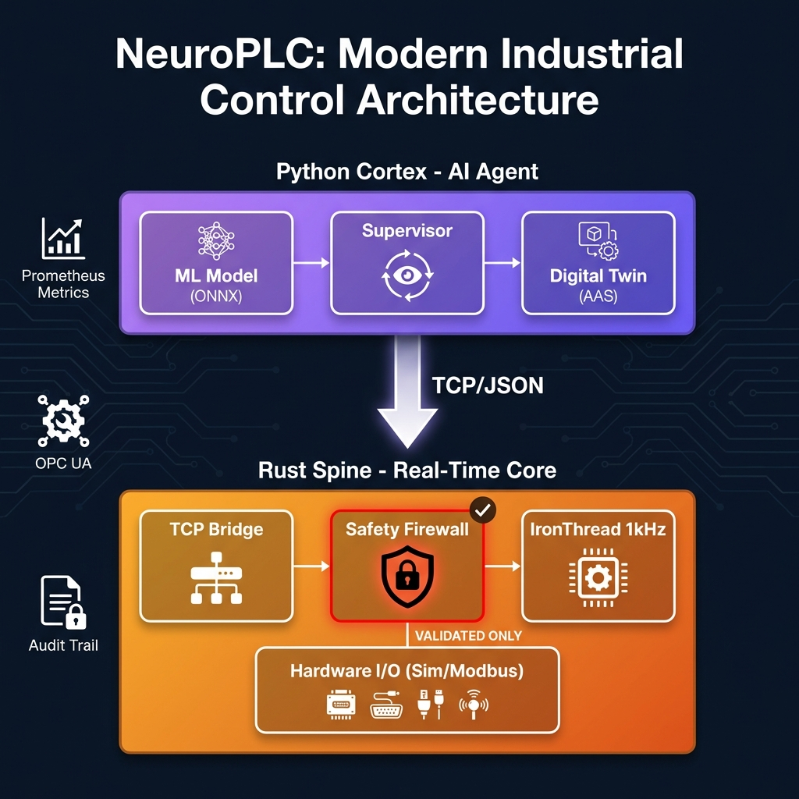

<p align="center">
  
  
  
  
</p>

<h1 align="center">⚡ NeuroPLC</h1>

<p align="center">
  <strong>Safety-First Agentic Industrial Controller</strong><br>
  <em>Where AI meets hard real-time control — and the machine always wins.</em>
</p>

<p align="center">
  <a href="#-quick-start">Quick Start</a> •
  <a href="#-architecture">Architecture</a> •
  <a href="#-features">Features</a> •
  <a href="#-deployment">Deployment</a> •
  <a href="docs/safety/safety-case.md">Safety Case</a>
</p>

---

## 🎯 What is NeuroPLC?

NeuroPLC is a **hybrid industrial controller** that combines the flexibility of AI-based decision making with the reliability of deterministic real-time control. It's designed for scenarios where:

- 🤖 **AI can suggest** — but unsafe commands must be rejected
- ⏱️ **1ms cycle times** are non-negotiable
- 📊 **Every decision is auditable** with cryptographic hashes
- 🏭 **Industrial protocols** (OPC UA, Modbus, AAS) are required

<p align="center">
  
</p>

---

## 🚀 Quick Start

### Prerequisites

- **Rust** 1.75+ (`rustup update`)
- **Python** 3.11+ with venv

### Run in 30 seconds

```bash
# Terminal 1: Start the Rust spine
cargo run --release

# Terminal 2: Start the Python cortex
cd python-cortex && python3 -m venv .venv && source .venv/bin/activate
pip install -e .
python run_supervisor.py
```

### Test the Safety Firewall

```bash
# Try to break it (you can't)
python run_supervisor.py --attack-mode
```

The cortex will periodically request **5000 RPM** (above the 3000 RPM limit). Watch the spine reject every unsafe command.

---

## 🏗️ Architecture

### Crate Structure

| Crate | Purpose | Key Types |
|-------|---------|-----------|
| **`core-spine`** | Real-time control loop, safety logic, HAL | `IronThread`, `Setpoint<Validated>`, `SafetyLimits` |
| **`neuro-io`** | Bridge I/O, protocols, auth, metrics | `BridgeConfig`, `ModbusMotor`, `TlsConfig` |
| **`neuro-plc`** | Runtime orchestration, integrations | `RuntimeConfig`, OPC UA, Rerun |

### Python Cortex

| Module | Purpose |
|--------|---------|
| `agent/supervisor.py` | ML-based recommendations + TCP client |
| `agent/ml_inference.py` | ONNX Runtime wrapper with safety bounds |
| `digital_twin/basyx_adapter.py` | AAS creation & live updates |

---

## ✨ Features

### 🛡️ Safety-First Design

```rust
// Type-state pattern: Only validated setpoints reach the actuator
let raw = Setpoint::<Unvalidated>::new(target_speed);
let safe = raw.validate(&limits, current_speed, temp)?;  // Returns Setpoint<Validated>
io.write_speed(safe.value());  // ✓ Compile-time safety guarantee
```

**Safety checks enforced:**
- ❌ NaN/Infinity rejection
- ❌ Overspeed protection (max 3000 RPM)
- ❌ Rate-of-change limiting (50 RPM/cycle)
- ❌ Temperature interlock (80°C threshold)

### 🔐 Enterprise Security

| Feature | Implementation |
|---------|----------------|
| **TLS 1.3** | rustls with certificate-based auth |
| **HMAC Tokens** | SHA-256 signed, time-bounded |
| **OPC UA Security** | Basic256Sha256 + SignAndEncrypt |
| **Audit Trail** | JSONL with SHA-256 reasoning hashes |

### 📊 Observability

```bash
# Enable Prometheus metrics
cargo run --release -- --metrics-addr 0.0.0.0:9090

# View metrics
curl http://localhost:9090/metrics
```

**Exposed metrics:**
- `neuroplc_cycles_total` — Control loop iterations
- `neuroplc_safety_rejections_total` — Rejected unsafe commands
- `neuroplc_cycle_jitter_us` — Timing precision histogram

### 🏭 Industrial Protocols

| Protocol | Status | Usage |
|----------|--------|-------|
| **OPC UA** | ✅ | `--features opcua --opcua` |
| **Modbus TCP** | ✅ | `--modbus 192.168.1.10:502` |
| **AAS/BaSyx** | ✅ | Python cortex auto-creates submodels |
| **AASX Export** | ✅ | `python scripts/export_aasx.py` |

### 🧠 AI/ML Integration

```bash
# Train your own model
cd python-cortex
python -m agent.train_model

# Run with ML inference
python run_supervisor.py --model models/neuro_v1.onnx
```

**ML Pipeline:**
- RandomForest → ONNX export
- Safety-bounded recommender wrapper
- Full audit trail with model hash

---

## 🐳 Deployment

### Docker Compose (Development)

```bash
docker compose up --build
```

**Services:**
- `neuroplc` — Rust spine + Python cortex
- `basyx` — BaSyx AAS GUI (http://localhost:8081)
- `prometheus` — Metrics (http://localhost:9090)

### Kubernetes (Production)

```bash
kubectl apply -f deploy/kubernetes/
```

See [`deploy/kubernetes/deployment.yaml`](deploy/kubernetes/deployment.yaml) for:
- Health/readiness probes
- Resource limits
- TLS secrets mounting
- Audit log persistence

### GitOps with ArgoCD

```bash
kubectl apply -f deploy/argocd/application.yaml
```

---

## 🧪 Testing

```bash
# Unit + Property tests (10,000 randomized inputs)
cargo test --all

# Integration tests (requires release build)
cargo build --release
cargo test --test integration_test -p neuro-plc
```

### Property-Based Testing

```rust
proptest! {
    #[test]
    fn overspeed_always_rejected(setpoint in 3000.01..10000.0) {
        let result = Setpoint::new(setpoint).validate(&limits, ...);
        assert!(matches!(result, Err(SafetyViolation::ExceedsMaxSpeed { .. })));
    }
}
```

---

## 📁 Repository Layout

```
NeuroPLC/
├── crates/
│   ├── core-spine/      # Real-time control & safety
│   ├── neuro-io/        # Bridge, Modbus, auth, metrics
│   └── neuro-plc/       # Runtime & integrations
├── python-cortex/       # AI supervisor
│   ├── src/agent/       # ML inference + supervisor
│   └── src/digital_twin/# BaSyx adapter
├── docker/              # Container builds
├── deploy/              # K8s + ArgoCD manifests
├── docs/
│   └── safety/          # IEC 61508 safety case
└── config/              # Prometheus config
```

---

## 📜 License

Dual-licensed under [MIT](LICENSE-MIT) or [Apache-2.0](LICENSE-APACHE) at your option.

---

<p align="center">
  <strong>Built for industrial reliability. Designed for AI agility.</strong><br>
  <em>NeuroPLC: The safety firewall your AI deserves.</em>
</p>
