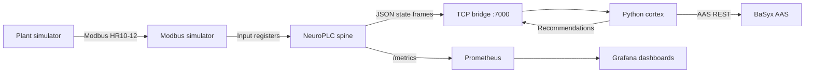
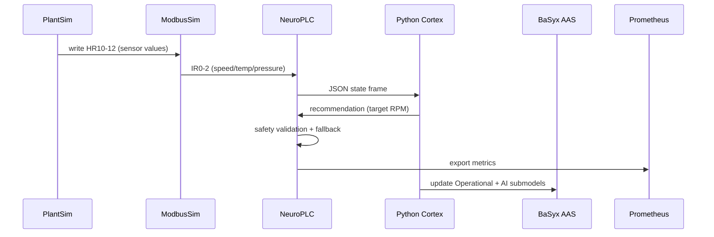

# Simulation Data Journey Report (Local)

Run date: 2026-01-12

This report captures an end-to-end simulated run of NeuroPLC using the local
simulation stack (Modbus plant, OPC UA simulator, BaSyx AAS, Prometheus, Grafana,
Jaeger). The goal is to verify the data path from simulated sensors through the
Rust spine, into the Python cortex, and back into safety-enforced actuation and
external integrations.

## Stack topology

- Modbus TCP simulator (`modbus-simulator`) mirrors plant-sim sensor registers.
- Plant simulator (`plant-simulator`) reads setpoints and writes sensor values.
- NeuroPLC spine runs on the host with the Modbus HAL enabled.
- Python cortex connects over the bridge and emits recommendations.
- BaSyx AAS captures operational and AI submodel updates.
- Prometheus scrapes NeuroPLC metrics (Grafana dashboards optional).

## Run commands

```bash
# 1) Start full simulation stack

docker compose -f docker/compose.simulation.yml up -d --build

# 2) Run NeuroPLC on the host (example)

RUST_LOG=info,neuro_io=trace \
  cargo run --release --features opcua --bin neuro-plc -- \
  --metrics-addr 0.0.0.0:9100 \
  --audit-log logs/sim/audit.jsonl \
  --modbus 127.0.0.1:5020 \
  --run-seconds 20

# 3) Run the Python cortex

BASYX_URL=http://localhost:8081 \
  NEUROPLC_SEND_HELLO=1 \
  python3 python-cortex/run_supervisor.py
```

## Visual data journey





## Evidence snapshot

### Bridge activity (spine log)

Example lines from `logs/sim/neuroplc.log`:

```
TRACE neuro_io::bridge: Bridge queued state frame, sequence: 160
DEBUG neuro_io::bridge: Recommendation received, target_speed: Some(200.0), confidence: 0.85
```

### Prometheus metrics snapshot

From `logs/sim/metrics.prom`:

| Metric | Value | Notes |
| --- | --- | --- |
| `neuroplc_bridge_connected` | `1` | Cortex connected |
| `neuroplc_cycles_executed_total` | `5361` | Control loop iterations |
| `neuroplc_agent_target_rpm` | `223` | Latest recommendation |
| `neuroplc_agent_confidence` | `0.85` | Latest confidence |
| `neuroplc_motor_temperature_celsius` | `40.1` | Simulated sensor |
| `neuroplc_system_pressure_bar` | `0.96` | Simulated sensor |
| `neuroplc_safety_rejections_total` | `0` | Safety firewall rejections |
| `neuroplc_safety_state` | `0` | 0 normal, 1 degraded, 2 trip, 3 safe |

### BaSyx AAS snapshot

From `logs/sim/basyx_status.json`:

| Property | Value |
| --- | --- |
| `MotorSpeedRPM` | `412.0` |
| `MotorTemperatureC` | `46.9` |
| `SystemPressureBar` | `1.11` |
| `CycleCount` | `81` |
| `SafetyState` | `normal` |

## Diagnosis (doctor mode)

- The bridge and cortex exchanged state/recommendations as expected.
- Safety remained **normal** with `0` rejections in this run.
- Warmup and rate limiting in the cortex prevent initial setpoint spikes from tripping the safety
  latch. You can tune with `NEUROPLC_WARMUP_CYCLES` and `NEUROPLC_MAX_RATE_RPM`.

## Repro notes

- Logs and snapshots for this run were captured under `logs/sim/` (not checked into git).
- If you want full console logs from the cortex, set `PYTHONUNBUFFERED=1`.
